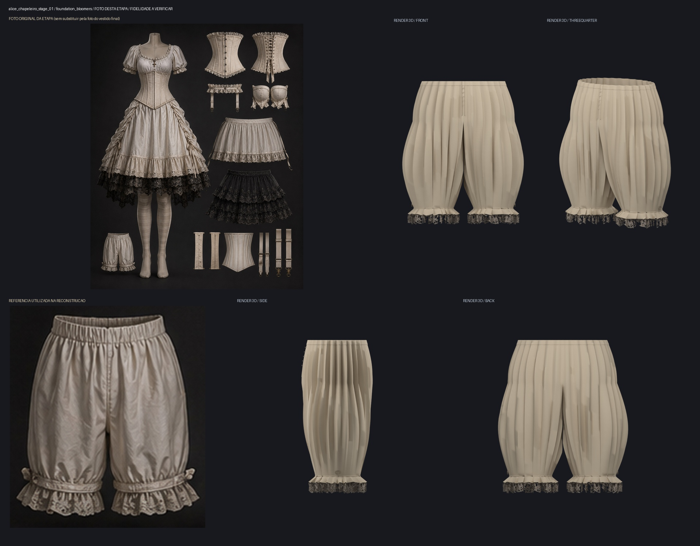

# Bloomers: ensaio estático, ainda em refinamento

O Blender resolveu 24 quadros reais da malha intermediária dos bloomers.
`probe_chapeleiro_bloomers_cloth.py` exportou a superfície deformada e seus
acabamentos vinculados. Pelve e coxas são volumes aproximados e ocultos usados
somente neste ensaio; não são o corpo final e não entram no GLB exportado.

A comparação conserva a foto original da ficha 1 e quatro renders da solução
real. As dobras permanecem regulares e profundas demais; franzidos dos punhos,
elástico da cintura e laços laterais ainda diferem da foto. A solução não foi
incorporada à fundação publicada. O relatório registra os deslocamentos de cada
quadro e os hashes do GLB e da superfície resolvida preservados localmente.

As malhas de origem permaneceram iguais. Este ensaio não contém rig nem
caminhada, corrida, salto ou ataque, e não aprova colisões durante gameplay.
A simulação não foi exportada como física nem teve seu cache persistido.

